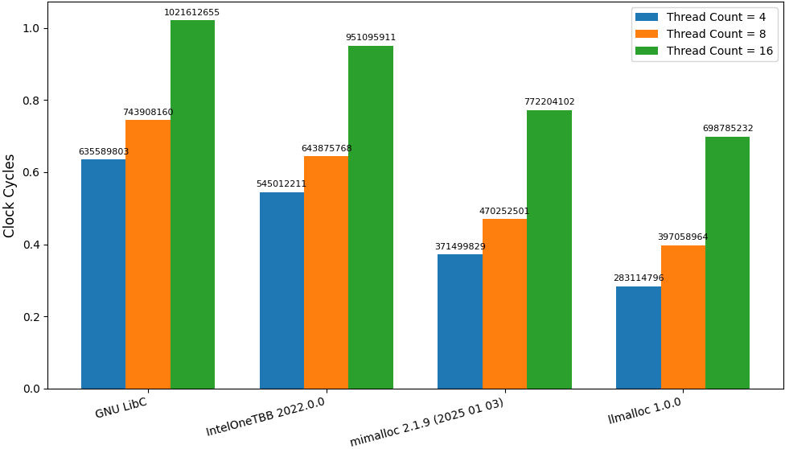
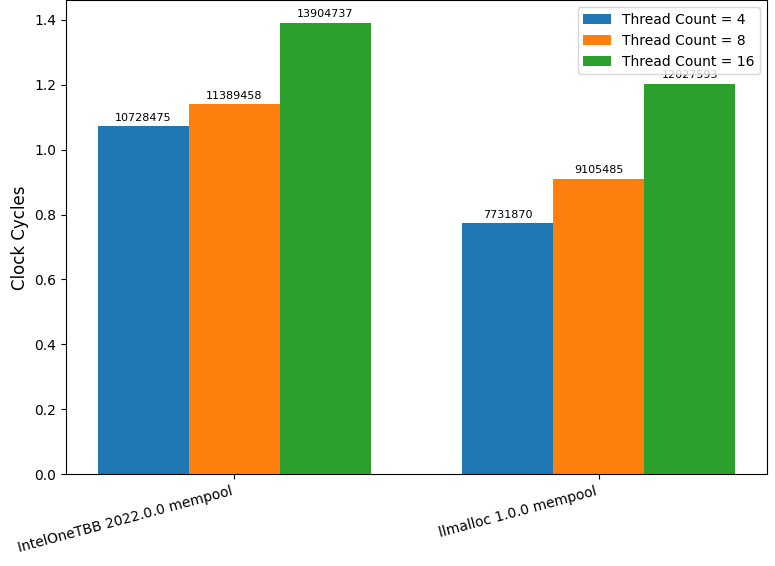

## <a name="intro"></a>**llmalloc**  

Latest version: 1.0.0

llmalloc is a low latency oriented thread caching allocator :

- Linux & Windows ( tested on : RHEL9.4, Windows11 )
- Easy integration : ~5K LOC single header & no dependencies ( optional NUMA pinning requires libnuma )
- On Linux, you can LD_PRELOAD
- Can be used with STL
- Has a builtin thread caching memory pool
- Huge page utilisation : Can utilise 2MB huge pages. 1GB ones not supported
- Can be pinned to a specified NUMA node ( Linux only , requires libnuma )
- Repo also provides [memlive](https://github.com/akhin/llmalloc/tree/main/memlive) : single header & no deps per-thread profiler to monitor allocations in your browser
- 64 bit only
- C++17 , GCC and MSVC ( tested on GCC 11.4.1, GCC 9.4.0, MSVC2022 )

* [Usage](#usage)
* [Benchmarks](#benchmarks)
* [Low latency trade-offs](#low_latency_trade_offs)
* [Tuning](#tuning)
* [Version history](#version_history)
* [References](#references)
* [Contact](#contact)

## <a name="usage"></a>Usage

Integration as library :

```cpp
#define ENABLE_OVERRIDE
#include <llmalloc.h>

int main()
{
    // In case of init failure llmalloc will throw an std::runtime_error exception
}

```

On Linux, you can also LD_PRELOAD : 

```bash
# Getting and building the shared object
git clone https://github.com/akhin/llmalloc.git
cd llmalloc/linux_ld_preload_so
chmod +x build.sh
./build.sh
# Using it
LD_PRELOAD=./llmalloc.so.1.0.0 your_executable
```

For Windows currently the only option is using the library with overrides as above or calling its allocate and deallocate methods explicitly. 

Examples directory has one [example](https://github.com/akhin/llmalloc/tree/main/examples/explicit_integration_doom3) for explicit integrations which builds Doom3 BFG with llmalloc on Windows.

STL usage :

```cpp
#include <llmalloc.h>
#include <vector>

int main()
{
    llmalloc::SingleThreadedAllocator::get_instance().create(); // Success check omitted
    std::vector<std::size_t, llmalloc::STLAllocator<std::size_t>> vector;

    for (std::size_t i = 0; i < 1000000; i++)
    {
        vector.push_back(i);
    }
}

```

For std::pmr containers , check the [STL example](https://github.com/akhin/llmalloc/tree/main/examples/stl) in the examples directory.

Thread caching memory pool :

```cpp
#include <llmalloc.h>

int main()
{
    llmalloc::ScalablePool<uint64_t> pool;
    pool.create(); // Success check omitted
    auto ptr = pool.allocate();
}

```

For huge pages and NUMA pinning, check the [examples](https://github.com/akhin/llmalloc/tree/main/examples) directory.

## <a name="benchmarks"></a>Benchmarks

Benchmark system : 2 x Intel Xeon Gold 6134 ( 16 non-isolated physical cores in total & hyperthreading disabled ) , CPU freq maximised @3.2GHz , DDR4 @2666MHz , RHEL9.4

To repeat the synthetic and real world benchmarks, you can use READMEs in the [benchmarks directory](https://github.com/akhin/llmalloc/tree/main/benchmarks) which describe all the steps. The directories include all the sources used.

I tried various real world software in benchmarks (Redis that was built with MALLOC=libc, Doom3 BFG, Quickfix), however no allocator was able to consistently outperfom the others due to their workloads.
I was able to get deterministic results with only synthetic benchmarks that put all pressure on allocation ops.

The global allocator benchmark makes interleaving inter-thread allocations and deallocations per thread : 3.2/6.5/13 million ops for 4/8/16 threads :

- Size classes vary from 16 byte to 32KB.
- Every single allocated byte is accessed ( both read and write ) during the benchmarks. 
- It uses shared objects of all allocators via LD_PRELOAD except GNU LibC.
- It retrieves RDTSCP to measure the clock cycles.

All numbers below are @percentile90 :

<p align="center">
    
</p>

The memory pool benchmark details are very similar to the global allocator one :

<p align="center">
    
</p>

The synthetic bm numbers are all from Linux since maxing CPU frequency on Windows is not as easy & deterministic as Linux. However they are also buildable and runnable on Windows. In my manual runs, global allocator and memory pool results were similar.

## <a name="low_latency_trade_offs"></a>Low latency trade-offs

#### Deallocations with no synchronisations
In all thread caching allocators, allocations don't need synchronisation since an allocation will always happen on its thread's local heap. However they use lock-free techniques for deallocations as a pointer may get freed on a different thread than the original allocation thread. That is known as an inter-thread pointer.

The most important low latency trade-off is that the llmalloc thread local heaps are not lock-free but they use no synchronisations at all during deallocations. That helps avoiding CPU-provided synchronisation primitives like CAS, TAS, FAD etc which are used in lock-free techniques.

Its disadvantage is that it may lead to higher virtual memory usage as the allocator won't be able to return pages with inter-thread pointers to the OS. A mitigation would be decreasing number of inter-thread pointers by deallocating pointers on their original creation threads in your application and that way llmalloc will be able to return more unused pages to the OS.

#### Cache locality
By default llmalloc does not use allocation headers per allocation to increase cache locality. In order to achieve that, the size infos are found by bitwise-masking addresses to retrieve 64 byte headers that are placed to the start of every page. And also it uses a semi lock-free hash map to store medium and large object addresses and padding bytes used for aligned allocations. 

As for its disadvantage, if you are allocating over 32KB objects extensively, you should use llmalloc_use_alloc_headers.so or do #define USE_ALLOC_HEADERS in the library to turn it off to avoid the cost of the hash map. That version of llmalloc uses 16 byte allocation headers.

#### Reduced contention
By default central heap is not utilised therefore all go through only thread local heaps. That is optional and can be turned off via options in case you have to accommodate many short living threads.

#### Size classes
All size classes are pow2. This helps to avoid searching for the size class bin during allocations. llmalloc small objects sizes are from 16 bytes to 32768 bytes. And medium object sizes are 64KB, 128KB and 256KB. And objects larger than 256 KB will be served directly with mmap/VirtualAlloc.

## <a name="tuning"></a>Tuning

The most important choice is the build type : whether going with the default "no allocation headers" or using the version with 16 byte allocation headers. That will depend on the workload. If the application is allocating over 32KB sizes extensively, you should go with allocation headers. ( Use llmalloc_use_alloc_headers.so or do #define USE_ALLOC_HEADERS in the library ).

After choosing the build type, you can try different options. The options described below are defined in llmalloc::ScalableMallocOptions which can be passed as a parameter to ScalableMalloc::get_instance().create. Alternatively you can also use environment variables :

- local_heaps_can_grow
    - Environment variable : llmalloc_local_heaps_can_grow
    - Default value : true (library) , 1 (env variable)
    - When it is true/1, the central heap won't be utilised. In case of many short living threads, you should turn it off.

- page_recycling_threshold
    - Environment variable : llmalloc_page_recycling_threshold
    - Default value : 10
    - llmalloc returns unused virtual memory pages to the OS only if their number exceed that threshold value for a size class. You can decrease the virtual memory footprint by lowering it and decrease the latency with higher values.

- deallocation_queues_processing_threshold
    - Environment variable : llmalloc_deallocation_queues_processing_threshold
    - Default value : 409600
    - llmalloc heaps initially will hold all deallocated pointers in a queue. Those pointers will be returned to their logical pages when the allocation counter exceeds this threshold value. The counter resets after queue processing. Lower values can help to reduce memory footprint and higher values may improve the latency.

- local_logical_page_counts_per_size_class & central_logical_page_counts_per_size_class
    - Environment variable : llmalloc_local_logical_page_counts_per_size_class & llmalloc_central_logical_page_counts_per_size_class
    - Default value : 1,1,1,1,1,1,1,2,4,8,16,32,8,16,32 ( an array in library and a string for env variables )
    - Initial page counts for size classes : 16,32,64,128,256,512,1KB,2KB,4KB,8KB,16KB,32KB,64KB,128KB,256KB. llmalloc's internal page size is 64KB for small objects and 512KB for medium objects. Using high values can reduce alloc/free latency but may cause cache misses in your app as the distance between objects may increase so tune carefully.

Mostly same options apply to the memory pool and STL allocators as well. You can check them in the following structs: ScalablePoolOptions & SingleThreadedAllocatorOptions.

Repo also provides Memlive which is a single header no deps per thread live profiler. After including it and calling its start function, you can monitor stats in a browser to find out peak pow2 usages : https://github.com/akhin/llmalloc/tree/main/memlive

## <a name="version_history"></a>Version history

- 1.0.0 : Initial version 

## <a name="references"></a>References

- Thread local deallocation queues don't use synchronisations however central heap deallocation queues need it. For that one, llmalloc uses a cosmetically modified version of Erik Rigtorp's lock-free mpmc code : https://github.com/rigtorp/MPMCQueue/ , MIT licence

## <a name="contact"></a>Contact

akin_ocal@hotmail.com