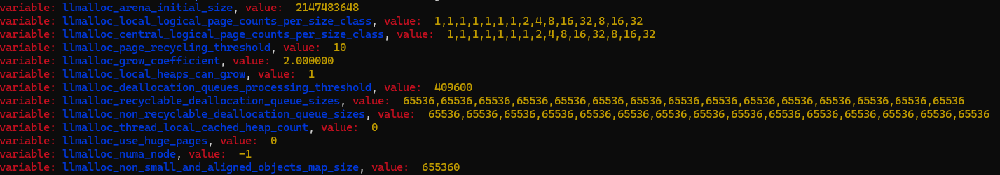

BUILDING LLMALLOC SHARED OBJECTS

```bash
chmod +x *.sh
./build.sh
```

To find out environment variables picked up by llmalloc, you can use the debug mode so :

```bash
LD_PRELOAD=./llmalloc_debug.so.1.0.0 ls
```

<p align="center">
    
</p>