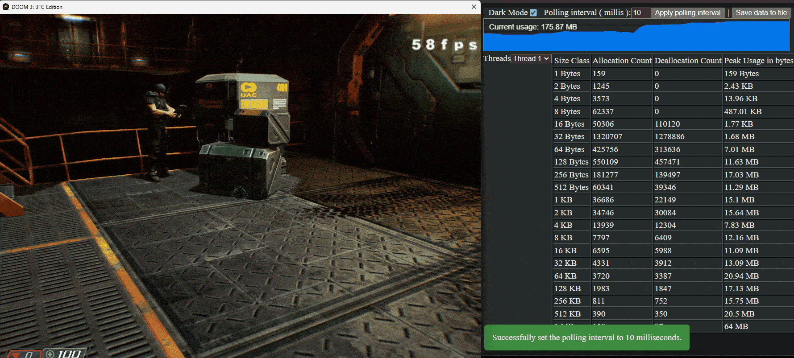

## <a name="intro"></a>**memlive**  

Memlive is a live per-thread allocation profiler for Linux and Windows. After building your application with it, you can monitor allocations in your browser : 

Doom3 BFG with memlive ( gif loading may take a while ) :

<p align="center">
    
</p>

* [Usage](#usage)
* [Implementation](#implementation)
* [Example integration : Doom3](#example_integration)

## <a name="usage"></a>Usage

```cpp
//#define MEMLIVE_MAX_SIZE_CLASS_COUNT 21 // 21 is the default in memlive.h so it will captures allocs up to 2^(21-1)/1 mb,  increase it if you need more
#include "memlive.h"
using namespace memlive;

int main()
{
    memlive::start(address, port_number); // At the start of your program
    //
    //
    //
    memlive::stop(); // At the end of your program
    return 0;
}

```

( On Windows, make sure that memlive.h is included before windows.h inclusion or do "#define WIN32_LEAN_AND_MEAN". That is due to a conflict between ws2tcpip.h and windows.h. )

After that you navigate to address:port_number in your browser. You can check "memlive example" in the example directory.

- You can adjust the max allocation size to capture by defining MEMLIVE_MAX_SIZE_CLASS_COUNT before including memlive.h. If not defined it will be defaulted to 21 which will capture allocations up to 1MB.

- In order to view total peak size, select "Total" in the left hand side drop down list. Overall peak usage will appear in the most bottom row.

- In order to minimise the load , you can change the polling interval ( Ajax polling between html/js and cpp side ) in your browser.

- In case you want to capture stats for only a sub part of your software, you can call memlive::reset just before the start of the sub part.

You can also use it for other custom allocators :

```cpp
#define MEMLIVE_DISABLE_REDIRECTIONS // Memlive will not redirect standard allocation and deallocation functions 

void* your_custom_allocate_function(std::size_t size)
{
    // Your custom allocation
    memlive::capture_custom_allocation(ptr, size);
    return ptr;
}

void your_custom_deallocate_function(void* ptr)
{
    std::size_t orig_allocation_size;
    memlive::capture_custom_deallocation(ptr, orig_allocation_size);
    // Your custom deallocation
}

```

## <a name="implementation"></a>Implementation

- It uses thread local storage for collecting per thread stats.

- It relies on malloc_usable_size on Linux and _msize/_aligned_msize on Windows to find out size class of deallocated pointers.

- It uses one reactor thread which does async IO. That thread's stats are excluded, therefore all stats you will see will belong only to your application.

- The embedded Javascript code has no external dependencies. Therefore you don't need internet connection to make it work.


## <a name="example_integration"></a>Example integration Doom3

Getting and building Doom3

1. Get the repo : git clone --recursive https://github.com/RobertBeckebans/RBDOOM-3-BFG.git
   
2. Buy Doom3 from Steam : https://store.steampowered.com/app/208200/DOOM_3/ And after installing it , you need to copy the assets to the "base" directory :
        
            from 
            
                C:\Program Files (x86)\Steam\steamapps\common\DOOM 3 BFG Edition\base

            to 
                base directory
   
3. Install Vulkan SDK https://www.lunarg.com/vulkan-sdk/ , and then edit neo/cmake-vs2022-win64-no-ffmpeg.bat file and add -DUSE_VULKAN=ON . ( This one is optional , it can be built with DX12 based on repo notes)
   
4. Run cmake-vs2022-win64-no-ffmpeg.bat ( cmake should be on system and available in PATH env variable )

5. Solution files will be under "build" directory , sibling to neo dir.

6. Open the Visual Studio solution and change all projects' C++ version to C++17.

7. Build and run.

To integrate memlive :

1. Copy memlive.h to neo/idlib. And then inside neo/idlib/Heap.h, replace Mem_Alloc and Mem_Free with the lines below :

```cpp
#define MEMLIVE_DISABLE_REDIRECTIONS
#include "memlive.h"

ID_INLINE void*     Mem_Alloc( const size_t size, const memTag_t tag )
{
    auto ret = Mem_Alloc16(size, tag);
    memlive::capture_custom_allocation(ret, size);
    return ret;
}

ID_INLINE void      Mem_Free( void* ptr )
{
    std::size_t orig_alloc_size = _aligned_msize(ptr, 16, 0);
    memlive::capture_custom_deallocation(ptr, orig_alloc_size); 
    Mem_Free16( ptr );
}

```

2. Inside neo/sys/win32/win_main.cpp, add "memlive::start("127.0.0.1", 4242);" to the first line of WinMain function :

```cpp
int WINAPI WinMain( HINSTANCE hInstance, HINSTANCE hPrevInstance, LPSTR lpCmdLine, int nCmdShow )
{
    memlive::start("127.0.0.1", 4242);
    ...
```

3. Rebuild and run then navigate to http://localhost:4242/ in your browser.